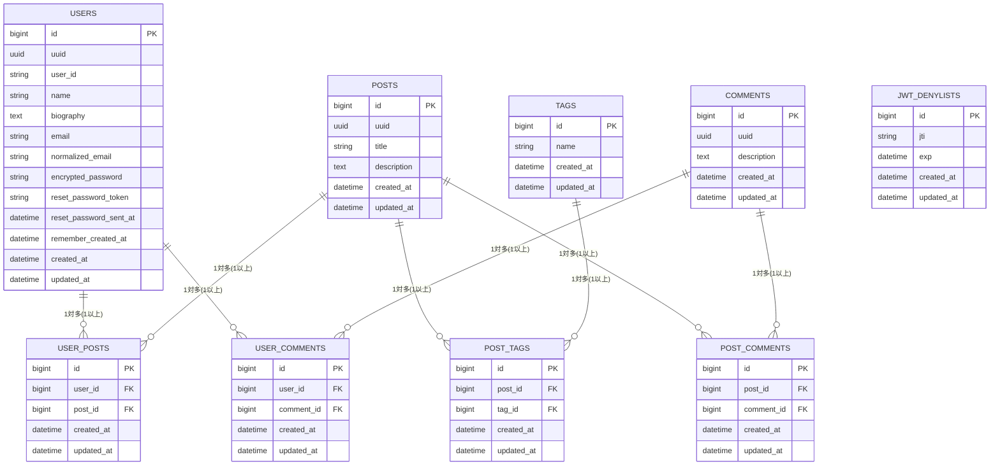

# Rails API、Next.js を使用したブログアプリ

## 使用技術

- フロントエンド
  - Node.js v20.11.0
  - react@19.0.0
  - typescript@5.6.3
  - next@15.1.0
- バックエンド
  - Ruby ruby 3.3.4
  - Rails 7.2.0
- データベース
  - PostgreSQL 16.2
- Web サーバー
  - nginx/1.23.4

## 必要要件

- Git
- Docker
- Docker Compose

## インストール

必要要件に記載している環境を整えた上で、ターミナルで下記コマンドを順番に実行してください。

```
git clone https://github.com/the-bears-field/nextjs_rails.git
```

```
cd nextjs_rails
```

```
sh initialization.sh
```

以上の過程を経てブラウザで[http://localhost](http://localhost)を開くと、閲覧可能となります。

## データベース設計


