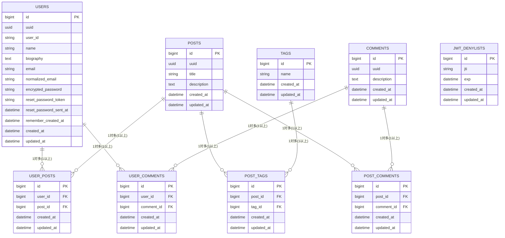

# Rails API、Next.js を使用したブログアプリ

## 使用技術

- フロントエンド
  - Node.js v22.18.0
  - react@19.1.1
  - typescript@5.9.2
  - next@15.5.2
  - zod@4.1.5
  - tailwindcss@4.1.13
  - jest@29.4.1
- バックエンド
  - Ruby 3.4.5
  - Rails 8.0.2
  - RSpec 3.13
- データベース
  - PostgreSQL 17.5
- Web サーバー
  - nginx/1.28.0

## 必要要件

- Git
- Docker
- Docker Compose

## インストール

必要要件に記載している環境を整えた上で、ターミナルで下記コマンドを順番に実行してください。

```
git clone https://github.com/the-bears-field/nextjs_rails.git
```

```
cd nextjs_rails
```

```
sh initialization.sh
```

以上の過程を経てブラウザで[http://localhost](http://localhost)を開くと、ポートフォリオの閲覧が可能となります。

## データベース設計


